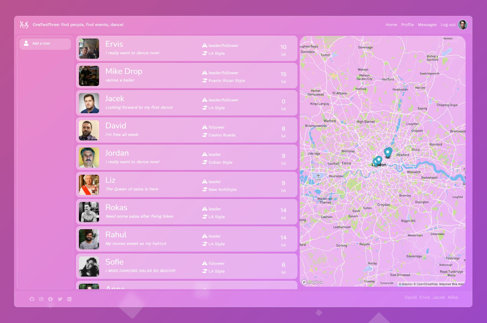
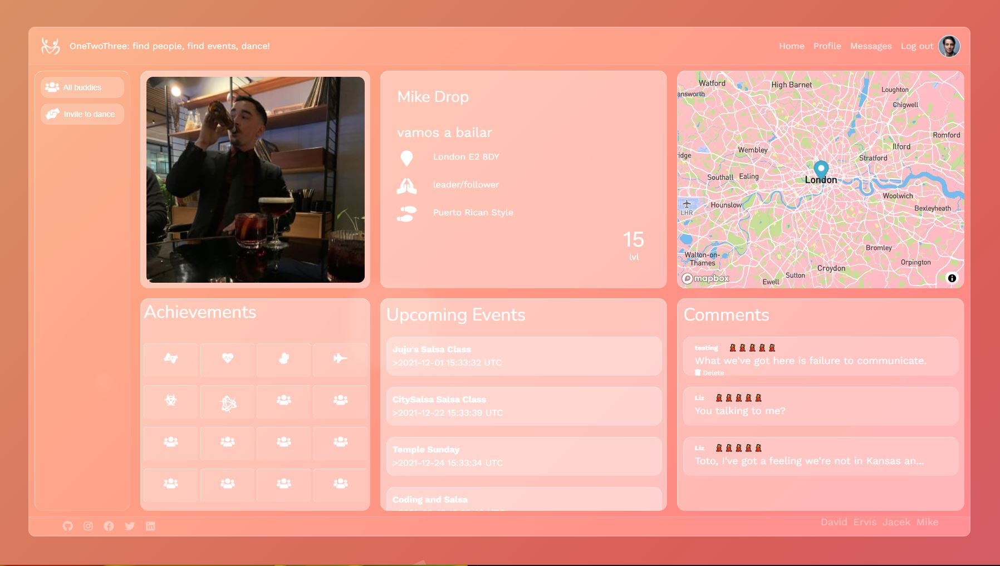
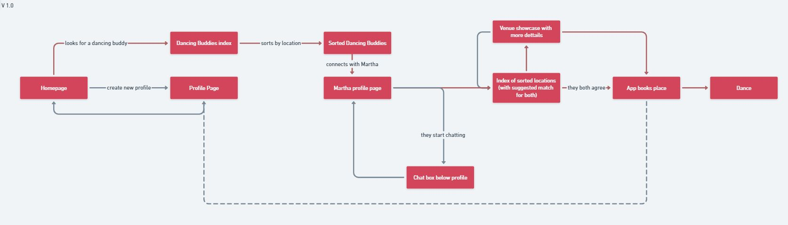
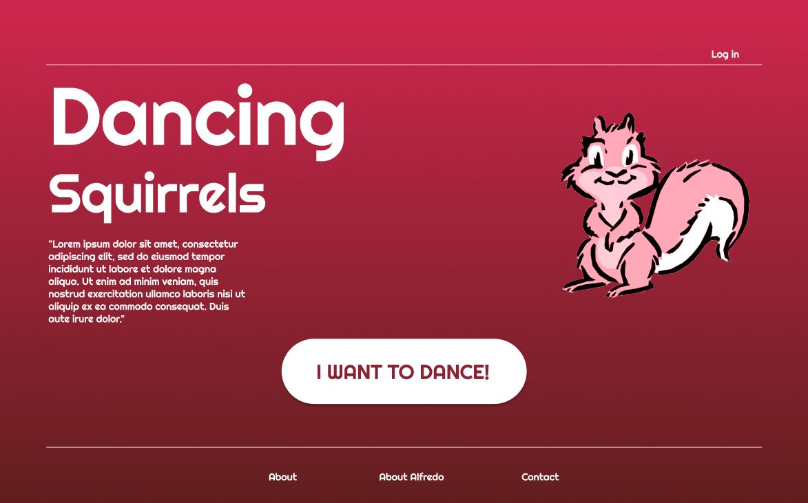
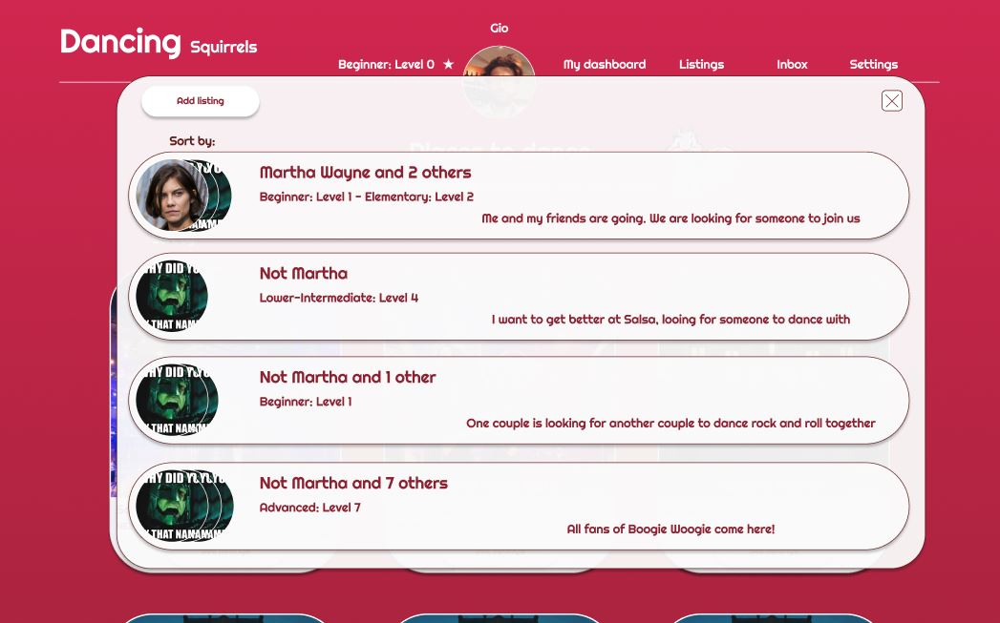
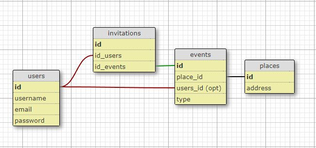
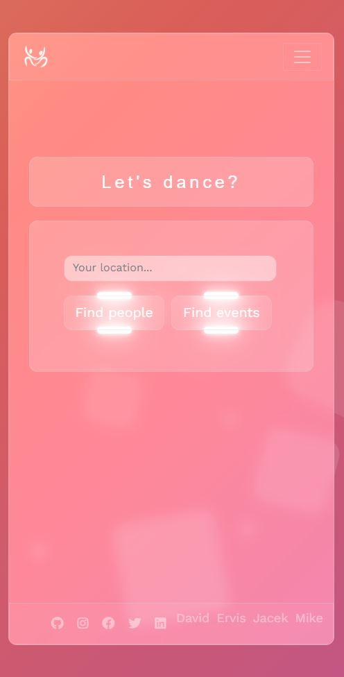
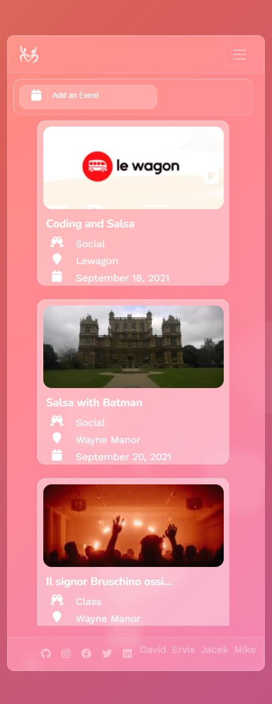

# One Two Three
## A social network app allowing to find a dancing buddy.

Have you ever wanted to go to a dancing class, but were too shy to go alone? 
OneTwoThree is a social network, enabling you to look for a buddy or a group of buddies to join a certain class with you.

Final group project of Le Wagon Web Development Bootcamp. Batch #601

The idea behind the project was to create a mini social network app, where people can organise themself around different dancing event places and classes and find dancing partner or entire group.
Another layer of the application was a gamification aspect with achievements system and levels depending on number of lessons completed and feedback from dancing partners.

Our team joyfully spent about half of the time given to produce the application on planning, designing on paper, Whimsical, Figma and sketching countless iterations of the schema. 🤨

As a result of the challenging second half, we came up with the product presented here that can be visited below.

### Enjoy!

The application is deployed to Heroku and available here:
## [One Two Three](http://www.onetwothree.live/)


<table>
  <tr>
    <td></td>
    <td></td>
    <td></td>
  </tr>
  <tr>
    <td></td>
    <td></td>
    <td></td>
  </tr>
</table>

## Getting Started
### Setup

Install gems
```
bundle install
```
Install JS packages
```
yarn install
```

### ENV Variables
Create `.env` file
```
touch .env
```
Inside `.env`, set these variables.
```
CLOUDINARY_URL=your_own_cloudinary_url_key
MAPBOX_API_KEY=your_own_mapbox_url_key
```

### DB Setup
```
rails db:create
rails db:migrate
rails db:seed
```

### Run a server
```
rails s
```

### Log in as testing@testing.com
### Password: testing

---


## Dev log

### Built With
- [Rails 6](https://guides.rubyonrails.org/) - Backend / Front-end
- [Stimulus JS](https://stimulus.hotwired.dev/) - Front-end JS
- [Heroku](https://heroku.com/) - Deployment
- [PostgreSQL](https://www.postgresql.org/) - Database
- [Bootstrap](https://getbootstrap.com/) — Styling
- [Figma](https://www.figma.com) — Prototyping


<h3 align="center">Languages and Tools:</h3>
<p align="center">
<a href="https://www.ruby-lang.org/en/" target="_blank" rel="noreferrer">  </a>
<a href="https://rubyonrails.org" target="_blank" rel="noreferrer">  </a>
<a href="https://www.postgresql.org" target="_blank" rel="noreferrer">  </a>
<a href="https://developer.mozilla.org/en-US/docs/Web/JavaScript" target="_blank" rel="noreferrer">  </a>
<a href="https://www.w3.org/html/" target="_blank" rel="noreferrer">  </a>
<a href="https://www.w3schools.com/css/" target="_blank" rel="noreferrer">  </a>
<a href="https://getbootstrap.com" target="_blank" rel="noreferrer">  </a>
<a href="https://git-scm.com/" target="_blank" rel="noreferrer">  </a> <a href="https://heroku.com" target="_blank" rel="noreferrer">  </a>
<a href="https://www.figma.com/" target="_blank" rel="noreferrer">  </a>
<a href="https://www.linux.org/" target="_blank" rel="noreferrer">  </a> <a href="https://www.photoshop.com/en" target="_blank" rel="noreferrer">  </a>
</p>

---

## Design process using whimsical

 Available at:
 [Whimsical/OneTwoThree](https://whimsical.com/onetwoothree-ULFikpkcZUHm4SbAgrxgxi)

<table>
  <tr>
    <td></td>
    <td></td>
    <td></td>
  </tr>
</table>

---

## UX/UI using Figma

 Available at:
 [Figma/OneTwoThree](https://www.figma.com/file/clp62GuwJqWbJr8DtdU6u4/Dancing-buddies?node-id=0%3A1)


<table>
  <tr>
    <td></td>
    <td></td>
  </tr>
  <tr>
    <td></td>
    <td></td>
  </tr>	
</table>

---

## Schema of the application changed a lot and went through many iterations

### The final schema of the application:


And some of the older versions:

<table>
  <tr>
    <td></td>
    <td></td>
    <td></td>
  </tr>
</table>

---


## Back End
Application consist of eight models in total!
-User
	- Entire User logic was created using [DEVISE](https://github.com/heartcombo/devise)
	- Authentication logic
	- Photo attachment using [Cloudinary](https://cloudinary.com/) as active_storage
	- After logging in User can either look for other users to dance with or look for places to dance.
- Place
	- Photo attachment using [Cloudinary](https://cloudinary.com/) as active_storage
	- Phisical object, schools of dance, music clubs with occuring dancing events
- Event
	- Photo attachment using [Cloudinary](https://cloudinary.com/) as active_storage
	- Is taking place in "The Place" (duh!)
	- Created by User, owner of the Place
	- May have many attendants, groups and invites
- Invite
	- User can either add yourself to the even, invite someone else straight to the event or create a grou or add someone an existing group of people going together to the given event.
	- Each user story have differen routes and path and its carrying different sets of params throughout all views. Not challenging at all. Not even a bit... 
- Group
	- Backbone of the aplication
	- Internal dashboard for group of people going together to that one given event in that one place.
	- Fully dynamic with responsive menu allowing to add participants and with build in chat created using WebSocket and ActionCable
- Review
	- After participating with some other user in an event or after beeing with him in a group you can leave a "review" at his profile pic that only you will be able to modify, a part of gamification aspect of the application, depending on rating of those reviews each user will progress with level and get a new achievement.
- Chatroom
	- Part of the live chat logic in Group model
- Message
	- Look above!

---

## Extra features

- Entire User logic with authentication done with [DEVISE](https://github.com/heartcombo/devise)
- Geolocation for Users and Places done with [Mapbox](https://www.mapbox.com/)
- Search Engine through Users or Places done with [pg_search](https://github.com/Casecommons/pg_search)
- Photo attachment using [Cloudinary](https://cloudinary.com/) as active_storage for Users, Places and Events
- AJAX for Reviews
- Webpack and Action Cable for Live Chat in Groups

---


## Front End

### There are some aspects of front end I'd like to mention

### Animated Background
Animated background of the application is done purely with use of CSS and this is something I'm the most proud of.
It consists of a div with gradient moving basically left to right and top to bottom.
Inside the div, there is an empty list that serves as those animated squares in the background.
```
<div class="gradient"></div>
<ul class="circles">
  <li></li>
  <li></li>
  <li></li>
  <li></li>
  <li></li>
  <li></li>
  <li></li>
  <li></li>
  <li></li>
  <li></li>
</ul>
```

While gradient is just translating its position in two axis, list elements are moving vertically, rotating and decreasing opacity at the same time in a loop.

```
.gradient {
  z-index: -10;
  position: fixed;
  width: 100%;
  height: 100%;
  background: linear-gradient(-45deg, #8741e6, #b2519f, #da5e58, #d8b46e);
  background-size: 400% 400%;
  animation: my-gradient 10s ease infinite;
  overflow: hidden;
}

@keyframes my-gradient {
  0% {
    background-position: 0% 50%;
  }
  50% {
    background-position: 100% 50%;
  }
  100% {
    background-position: 0% 50%;
  }
}

.circles{
  padding: 0;
  margin: 0;
  z-index: -9;
  position: fixed;
  top: 0;
  left: 0;
  width: 100%;
  height: 100%;
  overflow: hidden;
}

.circles li{
  position: absolute;
  display: block;
  list-style: none;
  width: 40vw;
  height: 40vh;
  background: rgba(255, 255, 255, 0.2);
  animation: animate 25s linear infinite;
  bottom: -150px;
  
}

.circles li:nth-child(1){
  left: 25%;
  width: 80px;
  height: 80px;
  animation-delay: 0s;
}
```

### Responsiveness
What's worth mentioning is the almost full responsiveness of the entire app.
It could use some final touches, but overall I'd like to present examples below:

<table>
  <tr>
    <td></td>
    <td></td>
    <td></td>
    <td></td>
    <td></td>
  </tr>
</table>


## Conclusion

Le Wagon Coding Bootcamp was simply the most amazing learning experience in my life with teaching quality I've never seen before and that application is the final showdown of all the skills acquired during the bootcamp.
There is still so much to do, but it's mostly refactoring and working on the front end.
The only important bit that is really missing is Testing and any TDD, CI/CD principles, but realistically, considering the time given - that was a necessary sacrifice.
Considering that this application is shared effort, despite all those missing elements I think it is a viable product and it suffices to leave it in that state.

## Acknowledgements

Big thank you to the most amazing team ever!

[Michale Barrett](https://github.com/michaelbarrett343) For all your work on the hardest bits with JS and best [Seed file](db/seeds.rb) I've ever seen! 👍

[Ervis Lapi](https://github.com/anadamastor) For the initial idea and giving your heart and soul into this app. 🤍

Once again - sorry guys for hijacking Front End of the App. I promise it's the last time! 😄

## License
This project is licensed under the MIT License.
